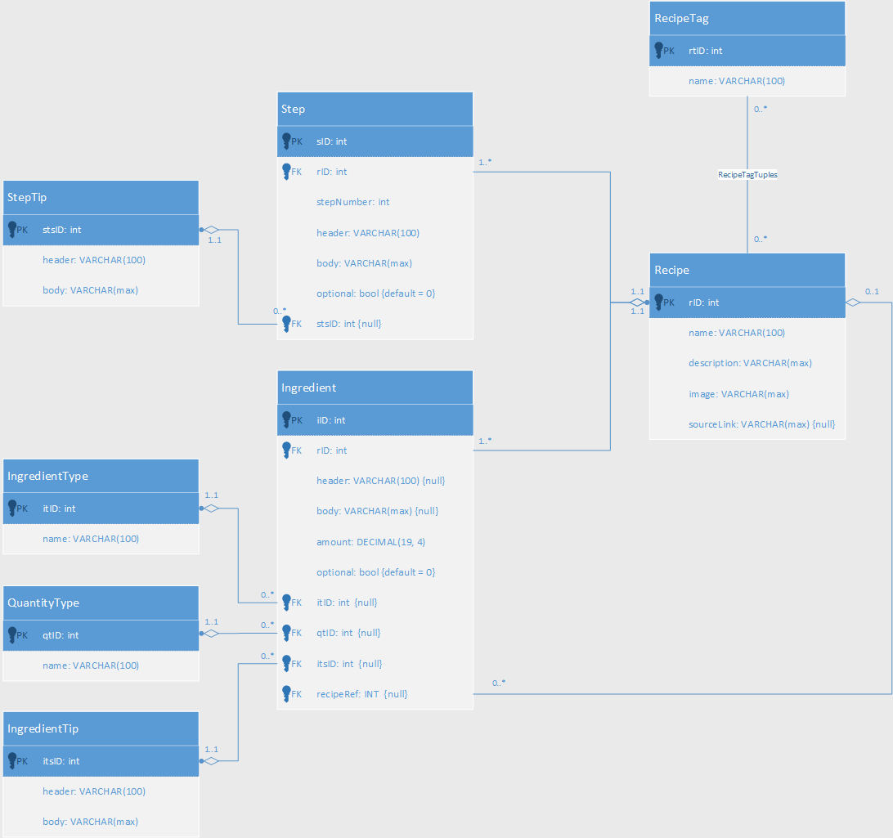

# Tables

A description of every table and the purpose of every attribute and its constraints.

## Table Of Content

- [Tables](#tables)
  - [Table Of Content](#table-of-content)
  - [RecipeTag](#recipetag)
    - [attributes](#attributes)
  - [Recipe](#recipe)
    - [attributes](#attributes-1)
  - [RecipeTagTuples](#recipetagtuples)
    - [attributes](#attributes-2)
  - [IngredientType](#ingredienttype)
    - [attributes](#attributes-3)
  - [QuantityType](#quantitytype)
    - [attributes](#attributes-4)
  - [IngredientTip](#ingredienttip)
    - [attributes](#attributes-5)
  - [Ingredient](#ingredient)
    - [attributes](#attributes-6)
  - [StepTip](#steptip)
    - [attributes](#attributes-7)
  - [Step](#step)
    - [attributes](#attributes-8)

## RecipeTag

A tag for the recipes used for searching for recipe based on a combination of them.

| Type      | Description                                                                                                        |         Example          |
| --------- | ------------------------------------------------------------------------------------------------------------------ | :----------------------: |
| Meal Type | The time of day recommended.                                                                                       |    Breakfast, Brunch     |
| Meat type | The type of meat used in the recipe. Note that it doesn't have to be in its pure meat (ex: sausage counts as meat) |      Beef, Chicken       |
| Dish Type | A general tag of the category of recipe.                                                                           |      Dessert, Salad      |
| Cuisine   | The cusisine the recipe belongs to.                                                                                |    Egyptian, Italian     |
| Taste     | The most dominant taste present in a recipe                                                                        |       Sweet, Spicy       |
| MISC      | Safety net for random tags                                                                                         | OnePot, PartyFood, Quick |

Every recipe doesn't have to have 1 tag from each category it can have multiple or none of each category.

### attributes

| Name |   Datatype   | Nullable |  MISC  | Purpose             |
| ---- | :----------: | :------: | :----: | ------------------- |
| rtID |     INT      |    ✘     | PK, AI | Table ID            |
| name | VARCHAR(100) |    ✘     |   -    | The name of the tag |

## Recipe

The General details about the recipe.

### attributes

| Name        |   Datatype   | Nullable |  MISC  | Purpose                                                                                                                         |
| ----------- | :----------: | :------: | :----: | ------------------------------------------------------------------------------------------------------------------------------- |
| rID         |     INT      |    ✘     | PK, AI | Table ID                                                                                                                        |
| name        | VARCHAR(100) |    ✘     |   -    | The name of the recipe                                                                                                          |
| description | VARCHAR(max) |    ✘     |   -    | A description of the recipe                                                                                                     |
| image       | VARCHAR(max) |    ✘     |   -    | URL of the image to use as a cover for the recipe                                                                               |
| sourceLink  | VARCHAR(max) |    ✔     |   -    | A link to the source of the recipe. Null means that it's a heavy modification of a recipe or the source is not on the internet. |
| notes       | VARCHAR(max) |    ✔     |   -    | user notes (currently there's no user system so notes will be added by the DB admin)                                            |

## RecipeTagTuples

The tags attached to each recipe.

### attributes

| Name | Datatype | Nullable |        MISC         | Purpose                 |
| ---- | :------: | :------: | :-----------------: | ----------------------- |
| rID  |   INT    |    ✘     |   FK(Recipe: rID)   | ID of the recipe to tag |
| rtID |   INT    |    ✘     | FK(RecipeTag: rtID) | ID of the tag           |

## IngredientType

A collection of ingredients used in recipe to be referenced in ingredient table.
Mainly used to unify naming of ingredients and for future expansions.

### attributes

| Name |   Datatype   | Nullable |  MISC  | Purpose                         |
| ---- | :----------: | :------: | :----: | ------------------------------- |
| itID |     INT      |    ✘     | PK, AI | Table ID                        |
| name | VARCHAR(100) |    ✘     |   -    | The name of the Ingredient Type |

## QuantityType

A collection of measuring units used in cooking.
Types: Volume, Mass, Length, MISC (ex: "piece", "can", ...)

### attributes

| Name |   Datatype   | Nullable |  MISC  | Purpose                       |
| ---- | :----------: | :------: | :----: | ----------------------------- |
| qtID |     INT      |    ✘     | PK, AI | Table ID                      |
| name | VARCHAR(100) |    ✘     |   -    | The name of the Quantity Type |

## IngredientTip

Tips that can be attached to ingredients.
Table exists to prevent redundancy of tips text in ingredient table.
Ex: "Fresh pasta is better".

### attributes

| Name   |   Datatype   | Nullable |  MISC  | Purpose                  |
| ------ | :----------: | :------: | :----: | ------------------------ |
| itsID  |     INT      |    ✘     | PK, AI | Table ID                 |
| header | VARCHAR(100) |    ✘     |   -    | The title of the Tip     |
| body   | VARCHAR(max) |    ✘     |   -    | The text body of the tip |

## Ingredient

All the details of an ingredient.

### attributes

| Name      |   Datatype   | Nullable |           MISC           | Purpose                                                                                        |
| --------- | :----------: | :------: | :----------------------: | ---------------------------------------------------------------------------------------------- |
| iID       |     INT      |    ✘     |          PK, AI          | Table ID                                                                                       |
| rID       |     INT      |    ✘     |     FK(Recipe: rID)      | The ID of the recipe this ingredient belongs to                                                |
| header    | VARCHAR(100) |    ✔     |            -             | The title of the Ingredient. Null means that this ingredient is under the main header.         |
| body      | VARCHAR(max) |    ✔     |            -             | The text body of the Ingredient.                                                               |
| amount    |   DECIMAL    |    ✘     |    CHECK(amount > 0)     | The amount required of the ingredient for the recipe                                           |
| optional  |  BIT(bool)   |    ✘     |        DEFAULT(0)        | whether this ingredient is optional or not                                                     |
| itID      |     INT      |    ✔     | FK(IngredientType: itID) | ID of the ingredient type. Null means that it's a recipe based ingredient                      |
| qtID      |     INT      |    ✔     |  FK(QuantityType: qtID)  | ID of the Quantity Type. Null means the ingredient doesn't need a measuring unit. ex: "1 egg". |
| itsID     |     INT      |    ✔     | FK(IngredientTip: itsID) | ID of the Ingredient Tip attached to this ingredient                                           |
| recipeRef |     INT      |    ✔     |     FK(Recipe: rID)      | The id of the recipe used as an ingredient. Null means it's a IngredientType based ingredient  |

Either itID or recipeRef can be only. (enforced by a CONSTRAINT)

## StepTip

A tip that should be attached to a step.
Table exists to prevent redundancy of tips text in ingredient table.
Ex: "salted water for pasta should taste like seawater".

### attributes

| Name   |   Datatype   | Nullable |  MISC  | Purpose                  |
| ------ | :----------: | :------: | :----: | ------------------------ |
| stsID  |     INT      |    ✘     | PK, AI | Table ID                 |
| header | VARCHAR(100) |    ✘     |   -    | The title of the Tip     |
| body   | VARCHAR(max) |    ✘     |   -    | The text body of the tip |

## Step

All of the details of Step in a recipe.

### attributes

| Name       |   Datatype   | Nullable |        MISC        | Purpose                                                              |
| ---------- | :----------: | :------: | :----------------: | -------------------------------------------------------------------- |
| sID        |     INT      |    ✘     |       PK, AI       | Table ID                                                             |
| rID        |     INT      |    ✘     |  FK(Recipe: rID)   | The ID of the recipe this Step belongs to                            |
| stepNumber |     INT      |    ✘     |         -          | The order of the step in the recipe under it's header                |
| header     | VARCHAR(100) |    ✔     |         -          | The title of the Step. Null means it's under the main list of steps. |
| body       | VARCHAR(max) |    ✘     |         -          | The text body of the Step                                            |
| optional   |  BIT(bool)   |    ✘     |     DEFAULT(0)     | whether this Step is optional or not                                 |
| stsID      |     INT      |    ✔     | FK(StepTip: stsID) | The ID of the tip attached to this step                              |
